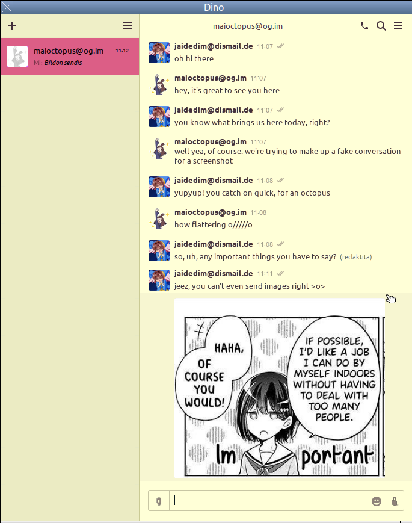
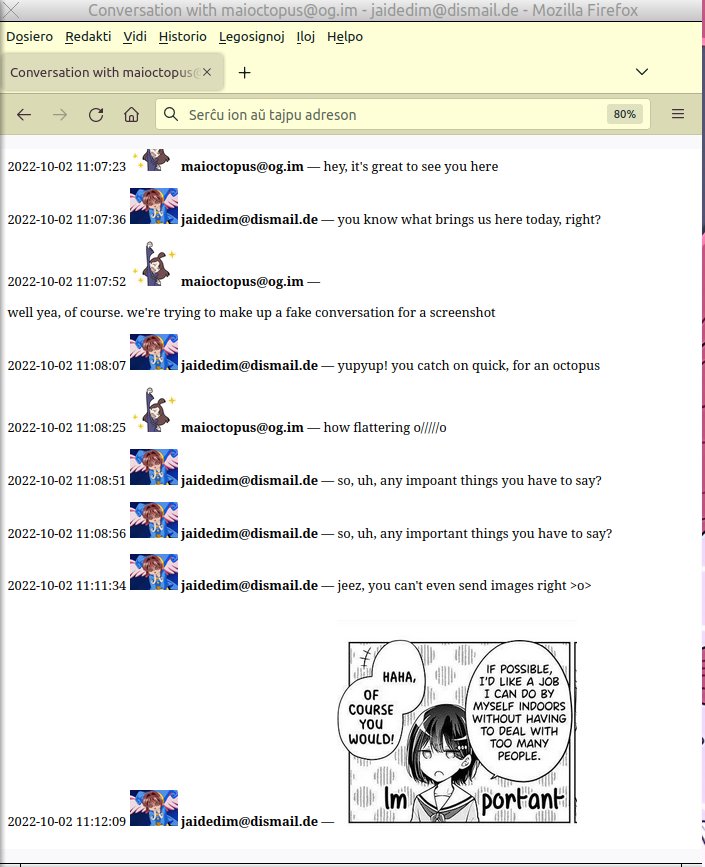

# dino-chat-export

Export chats and files from the XMPP client [Dino](https://dino.im) into a plain-text format.





## Usage
`$ ./dino-chat-export /tmp/xmpp-archive/`

This script's only non-base requirement is `sqlite3`.
It takes one argument, the output directory. The output tree ends up looking something like this:

```
$ tree /tmp/xmpp-archive/
/tmp/xmpp-archive/
└── youraccount@domain.tld
    ├── yourfriend@otherdomain.tld
    │   ├── files
    │   │   ├── sldfj_some_attached_file.pdf
    │   │   ├── their_avatar.png
    │   │   └── your_avatar.png
    │   └── messages.txt
    ├── evilperson@evilcompany.com
    │   ├── files
    │   │   ├── their_avatar.png
    │   │   └── your_avatar.png
    │   └── messages.txt
```

By default, each message is output in `YYYY-MM-DD <$user> $message` format, but you can customize
the output of this script with environment variables.


### Environment variables

| Variable          | Description                                                   | Example                                 |
| ----------------- | ------------------------------------------------------------- | --------------------------------------- |
| `$DINO_HOME`      | Dino data directory                                           | `~/.local/share/Dino`                   |
| `$MESSAGE_HEADER` | Text preceding each message file, with basic substitutions.   | `<html><title>THEIR_JID</title><body>`  |
|                   | Substitutions: THEIR_JID, YOUR_JID, THEIR_NICK, YOUR_NICK     |                                         |
| `$MESSAGE_FOOTER` | Likewise, but is output to the end of each message file.      | `</body></html>`                        |
| `$MESSAGE_FORMAT` | Template for message output, in a printf style.               | `[%s] <%s>: %s`                         |
| `$MESSAGE_SLOTS`  | Comma-delimited arguments for $MESSAGE_FORMAT                 | `DATE,JID,BODY`                         |
|                   | Valid slots: AVATAR, BODY, DATE, JID                          |                                         |
| `$IMAGE_FORMAT`   | Format for message-bodies containing an image.                | ``                      |
| `$FILE_FORMAT`    | Same as `$IMAGE_FORMAT`, but for non-image files.             | `<a href src="%s">Uploaded file</a>`    |


## Examples
### HTML output
Here are some environment variables you can use to get rudimentary, unstyled HTML output:

```shell
$ export MESSAGE_FORMAT='<div class='message'><datetime>%s</datetime>  <b>%s</b> — <p>%s</p></div>'
MESSAGE_SLOTS='DATE,AVATAR,JID,BODY'
MESSAGE_HEADER='<!DOCTYPE html>
<html>
<head>
	<title>Conversation with THEIR_JID - YOUR_JID</title><
	<link rel="stylesheet" type="text/css" href="../style.css" />
</head>
<body>'
MESSAGE_FOOTER='</body>
</html>'
IMAGE_FORMAT=''
FILE_FORMAT='<a href="%s" />%s</a>'
$ ./dino-chat-export ~/Archive/Chats/XMPP/
```

Feel free to spice it up with some real CSS!


## Meta
License is the GNU GPLv3+, COPYING.txt.

- https://notabug.org/jadedctrl/dino-chat-export
- https://github.com/jadedctrl/dino-chat-export
